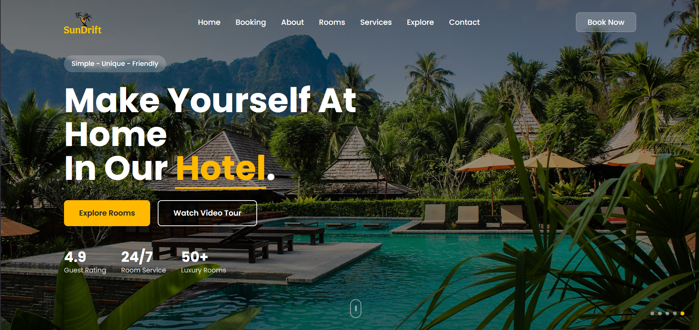
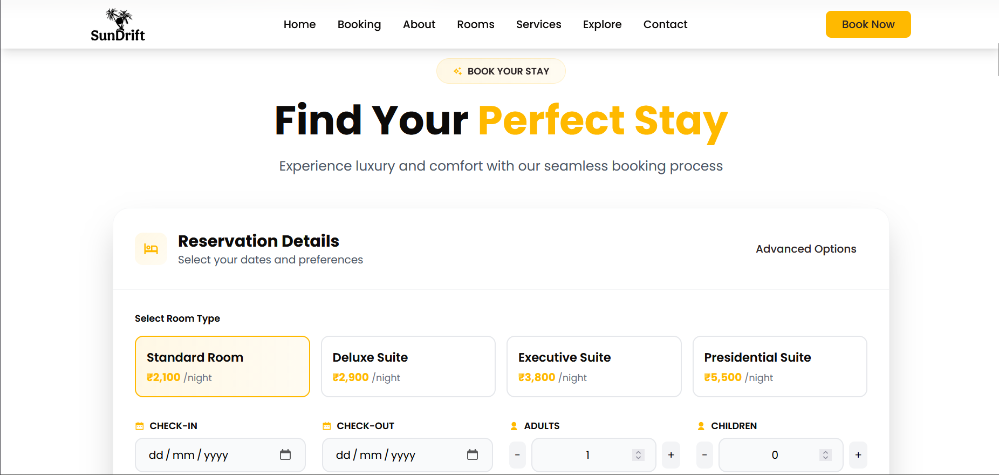
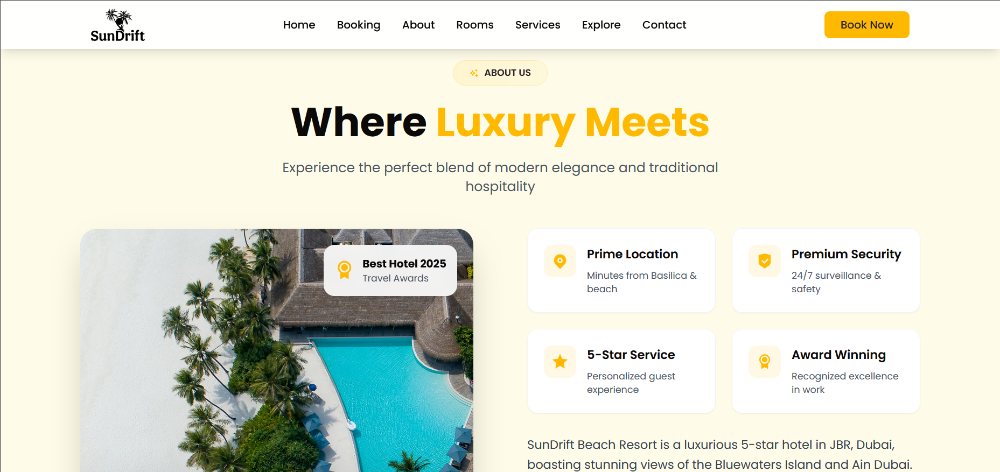
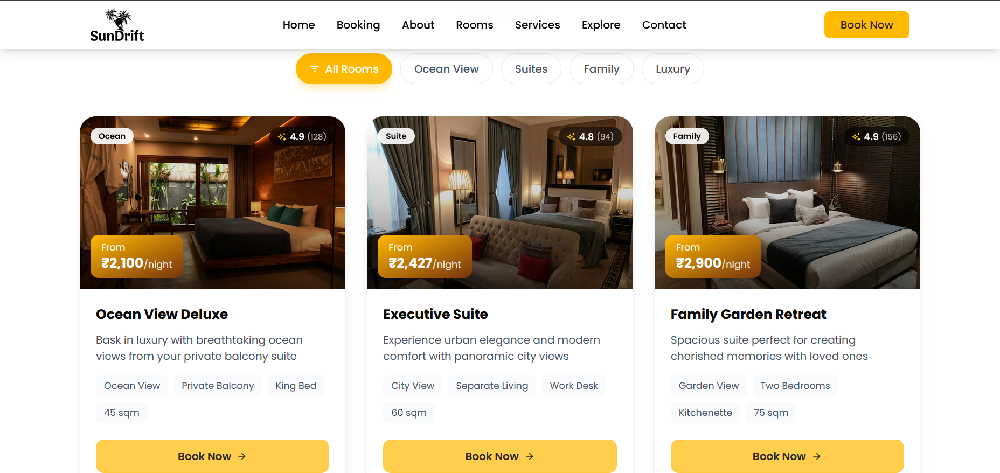
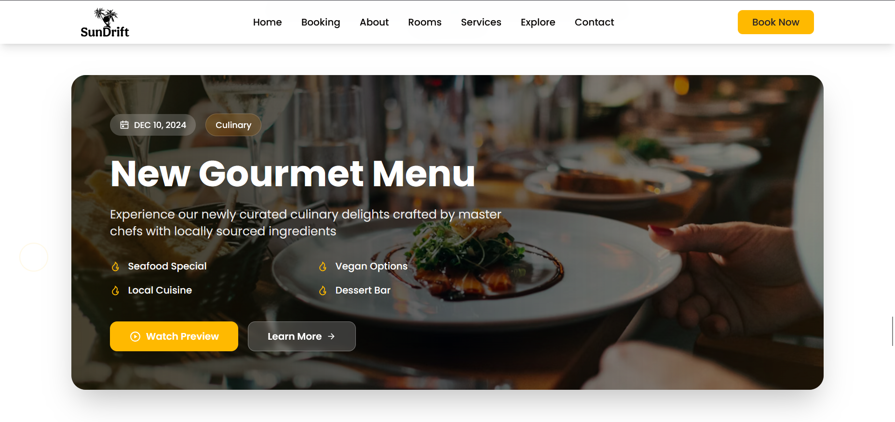

# 🏖️ SunDrift Beach Resort - Luxury Hotel Website

A modern, responsive luxury beach resort website built with React, TypeScript, Tailwind CSS, and Framer Motion. This project showcases a premium hotel booking experience with stunning visuals, smooth animations, and a fully responsive design.

### 🚀 Live Demo  

<p>
  <a href="https://hotelsundrift.netlify.app/" target="_blank">
    
  </a>
</p>


<div align="center">
  
</div>

## 🌟 Features

### Modern Tech Stack

 - React 18 with TypeScript for type-safe development
 - Vite for fast development and optimized builds
 - Tailwind CSS for utility-first styling
 - Framer Motion for smooth animations
 - Lucide React for beautiful icons

### Premium UI/UX Features

 - 🎨 Glass Morphism & Gradient Design - Modern visual effects
 - ✨ Smooth Animations - Page transitions and micro-interactions
 - 📱 Fully Responsive - Mobile-first design approach
 - 🌊 Hero Image Slider - Auto-rotating luxury resort images
 - 🎯 Interactive Booking Form - Modern form with advanced options
 - 🏖️ Parallax Effects - Scroll-based animations
 - 💫 Micro-interactions - Hover and click animations
 - 🎛️ Expandable Sections - Collapsible content areas

### Pages & Sections

 1. Hero Section - Stunning full-screen image slider with parallax <br/>
 2. Booking Form - Modern, interactive booking interface <br/>
 3. About Section - Resort features with statistics and trust indicators <br/>
 4. Rooms Section - Luxury room cards with detailed information <br/>
 5. Services Section - Premium amenities with visual icons <br/>
 6. Stats Section - Animated counters and metrics <br/>
 7. Footer - Comprehensive contact and navigation <br/>

## 📸 App Screenshots
  <div align="center"> 
      
      
      
     
     
  </div>

## 🚀 Quick Start

### Prerequisites
    
 - Node.js 16.x or higher
 - npm or yarn package manager

### Installation

1. Clone the repository

    git clone https://github.com/suniltechs/SandDrift_Beach_Resort.git
    cd sundrift_beach_resort

2. Install dependencies
    ```
    npm install
    # or
    yarn install
    ```

3. Start the development server
    ```
    npm run dev
    # or
    yarn dev
    ```

4. Open your browser
   ```
    Navigate to http://localhost:5173
   ```

## Project Structure

    SandDrift_BeachProject/
    ├── public/
    ├── src/
    │   ├── app/
    │   │   ├── store.ts
    │   │   └── hooks.ts
    │   ├── components/
    │   │   ├── ui/              # Reusable UI elements (Button, Modal, etc.)
    │   │   └── sections/        # Page sections (Hero, Features, etc.)
    │   ├── features/
    │   │   └── booking/         # Domain-specific logic (e.g., booking form)
    │   ├── types/
    │   │   └── index.ts         # Global types and interfaces
    │   ├── utils/
    │   │   └── constants.ts    # Utility functions
    │   ├── App.tsx
    │   ├── main.tsx
    │   └── index.css
    ├── .gitignore
    ├── eslint.config.js
    ├── netlify.toml
    ├── package.json
    ├── package-lock.json
    ├── postcss.config.js
    ├── tailwind.config.js
    ├── tsconfig.json
    ├── tsconfig.app.json
    ├── tsconfig.node.json
    └── vite.config.ts
## 🎨 Design System

### Color Palette

 - Primary: Amber/Gold (#ffb900)
 - Secondary: Amber-600 (#fe9a00)
 - dark: (#0c0a09), 
 - light: (#ffffff),

### Animations

 - Spring animations for natural motion
 - Staggered reveals for content sections
 - Parallax effects for depth
 - Micro-interactions for user feedback

### 🛠️ Technologies Used

 - React 18 - Frontend library
 - TypeScript - Type safety
 - Vite - Build tool and dev server
 - Tailwind CSS - Utility-first CSS framework
 - Framer Motion - Animation library
 - React Icons - Icon library
 - Redux - Global state management library
 - Unsplash - High-quality images

### 📱 Responsive Breakpoints

 - Mobile: < 640px
 - Tablet: 640px - 1024px
 - Desktop: > 1024px
 - Large Desktop: > 1280px

### 🚀 Performance Optimizations

 - Code Splitting: Automatic by Vite
 - Image Optimization: Unsplash CDN with auto-format
 - Tree Shaking: Unused code removal
 - Minification: Production build optimization
 - Lazy Loading: Component and image lazy loading

## 📝 Custom Components

### Button Component (Button.tsx)

Reusable animated button with variants:

 - Primary (gradient background)
 - Secondary (solid color)
 - Outline (bordered)

### Hero Section (Hero.tsx)

 - Auto-rotating background images
 - Parallax scroll effects
 - Interactive image navigation
 - Animated text reveals

### Booking Form (BookingForm.tsx)

 - Modern date pickers
 - Interactive guest counters
 - Expandable advanced options
 - Filter chips with animations

## 🌐 Deployment

### Deploy to Vercel
    npm run build
    vercel --prod

### Deploy to Netlify
    npm run build
    netlify deploy --prod
### Build Output

 - Output directory: dist/
 - Optimized for production
 - Compressed assets
 - Cache headers configured

## 🧪 Testing

### Development Testing
    # Check for TypeScript errors
    npm run type-check

    # Check ESLint rules
    npm run lint

### Browser Support

 - Chrome 90+
 - Firefox 88+
 - Safari 14+
 - Edge 90+

## 🔒 Security Features

 - Type-safe development
 - Dependency vulnerability scanning
 - HTTPS ready
 - Secure headers configuration

### 🤝 Contributing

1. Fork the project
2. Create your feature branch (git checkout -b feature/AmazingFeature)
3. Commit your changes (git commit -m 'Add some AmazingFeature')
4. Push to the branch (git push origin feature/AmazingFeature)
5. Open a Pull Request

## Acknowledgments

 - Images from Unsplash
 - Icons from Lucide
 - Fonts from Google Fonts
 - Animation library Framer Motion

### Developer

Developed by [Sunil Sowrirajan](https://www.linkedin.com/in/sunil-sowrirajan-40548826b/)

[](https://github.com/suniltechs)
[](https://www.linkedin.com/in/sunil-sowrirajan-40548826b/)
[](https://sunilsowrirajan.netlify.app/)
